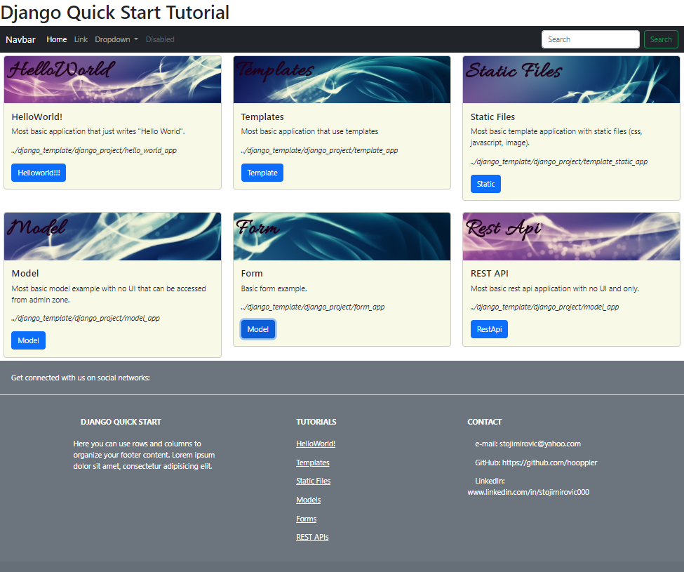

# Django Quick Start Tutorial
**Cheat Sheat**
***

Author: Aleksandar Stojimirovic\
e-mail: stojimirovic@yahoo.com

## Introduction
Details about Django framework can be found at:
https://www.djangoproject.com/

Django application consists of two parts:
- Project
- Applications
It follows plugin architecture where within an Django project can be registered manu independent applications.



## Django Installation

**From command line:**  
Create the project folder:
``` 
..> mkdir django_template  
```
  
Create a virtual environment in project folder:  
```
..> cd django_template  
..> python -m venv env  
```

Activate the virtual environment:  
```
..> env\Scripts\activate (or linux env/bin/activate)  
```
  
Install Django framework:  
```
..> pip install django  
```

**Using pyCharm:**
- Create new project 'django_template' which will authomatically create virtual environment
- From terminal write:
```
..> pip install django
```

## Create Django Project
To create new project use django-admin script:  
```
..> django-admin startproject django_project  
```

Test web server can be started from django_project directory to show build in hello world page:\
```
..> python manage.py runserver
```

It will print URL of server in the form:
Starting development server at http://local_ip_address:port/

Copy URL to browser and hello world page will apear.


## Create Django Application
To create new application use django-admin script  
(Applications should be placed within django project)  
```
..> cd django_project  
..> django-admin startapp hello_world_app  
```

**Include Application to Django Project**
Leave only view.py, __init__.py, and migrations in hello_world_app folder.
Add http response (view) method to view.py file:

```
from django.shortcuts import render
from django.http import HttpResponse


def hello_world_view(request):
    return HttpResponse("Hello World !!!")
	
From urls.py in django_project add new url for new view:

...
from hello_world_app.views import hello_world_view
...
urlpatterns = [
	...
	path('helloworld/', hello_world_view),
	...
]
```

Register new application to django in django_project/settings.py:

```
INSTALLED_APPS = [
	...
	'hello_world_app',
	...
]
```

Start test server and from browser call:\
http://local_ip_address:port/helloworld

It shold be printed 'Wello World !!!" from the browser.

## Create Template
It should be created template folder with folder named by application.
```
django_template -> django_project -> template_app -> templates -> template_app
```	   

Render template from view.
```
view.py

from django.shortcuts import render

def template_view(request):
    return render(request, "template_app/template.html")
```

Create django template in html with support of DTL (Django Template Language)
```html
templat.html

<!DOCTYPE html>
<html lang="en">
<head>
	<meta charset="UTF-8">
	<title>Title</title>
</head>
<body>
	<h1>Lorem Ipsum</h1>
	<p>Some text!!!</p>
</body>
</html>
```

## Create Model
Django model is a class that inherits Model class and represents Object Relational Mapping (ORM) to database.

Class has following format:
```python
models.py

from django.db import models

class Person(models.Model):
    att_char = models.CharField(max_length=N)
    att_binary = models.BinaryField()
	att_boolean = models.BooleanField()
	att_null_boolean = models.NullBooleanField()
	att_data = models.DateField()
	att_time = models.TimeField()
	att_datetime = models.DateTimeField()
	att_duration = models.DurationField()
	att_auto = models.AutoField()	
	att_big_integer = models.BigIntegerField()	
	att_decimal = models.DecimalField(decimal_places=X,max_digits=Y)	
	att_float = models.FloatField()	
	att_integer = models.IntegerField()	
	att_positive_integer = models.PositiveIntegerField()	
	att_positive_small_integer = models.PositiveSmallIntegerField()	
	att_small_integer = options.SmallIntegerField()	
	att_text = models.TextField()	
	att_comma_separated_integer = models.CommaSeparatedIntegerField(max_length=50)	
	att_email = models.EmailField()	
	att_file = models.FileField()	
	att_file_path = models.FilePathField()	
	att_image = models.ImageField()	
	att_generic_ip_address = models.GenericIPAddressField()	
	att_slug = models.SlugField()	
	att_url = models.URLField()	
	att_uuid = models.UUIDField()	
	
    def __str__(self):
        return 'Object name'

```

In order to be visible from admin zone it should be registered first:

```
admin.py

from django.contrib import admin
from myapp.models import Person

admin.site.register(Person)
```

To use model migrations file should be created and generated database:
```
..> python manage.py makemigrations
..> python manage.py migrate
```

